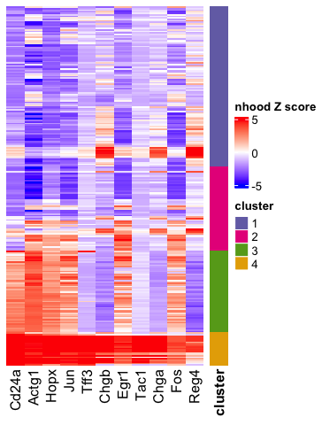

RECOMBINE identifies recurrent composite markers for common and rare
cell subpopulations of mouse intestinal organoids
================

This tutorial introduces you to apply RECOMBINE to a scRNA dataset for
characterizing recurrent composite markers (RCMs) of cell
subpopulations. Here, we use a scRNA-seq dataset of mouse intestinal
organoid cells originally described in Grün, D., et al. (2015).
Single-cell messenger RNA sequencing reveals rare intestinal cell types.
Nature, 525(7568), 251–255. RECOMBINE was applied to this dataset to
extract recurrent composite markers (RCMs) for both major and rare cell
subpopulations.

To facilitate running this tutorial without the need of downloading the
original datasets, we have provided precomputed data objects at
<https://github.com/korkutlab/recombine_datasets>. Please download and
put the directory intestine_data_precomp under the current working
directory.

``` r
library(recombine)
library(tidyverse)
library(Seurat)
library(RColorBrewer)
library(ggpubr)
library(ComplexHeatmap)
library(circlize)
library(enrichR)
```

## Data preprocessing

The following function gives details of data preprocessing by following
the original and related papers. To run the function, we need to
download the scRNA dataset of the whole mouse intestinal organoid from
the Gene Expression Omnibus (GEO; GSE62270) and put it in the directory
called data under the current directory. Without downloading the
original dataset, we can load the preprocessed data object in the
directory intestine_data_precomp.

``` r
intestine_scRNA_data_preprocess <- function() {
  tb <- read_tsv("./data/GSE62270_data_counts_Whole_Organoid_Replicate_1.txt.gz")
  mt <- as.matrix(tb[, -1])
  rownames(mt) <- tb$GENEID
  
  # preprocess data by following Supplementary Data 3 of 2015 Nature Grun
  # (This file contains a manual of the R code for the RaceID algorithm)
  
  # remove ERCC
  mt <- mt[grep("ERCC",rownames(mt), invert=TRUE), ]
  
  # keep cells with more than mintotal transcripts 
  mintotal <- 3000
  mt <- mt[, colSums(mt) > mintotal]
  
  # After discarding cells with less than mintotal transcripts, 
  # the expression data are normalized. 
  # Normalization is performed by dividing transcript counts in each cell 
  # by the total number of transcripts in this cell followed by multiplication 
  # with the median of the total number of transcripts across cells.
  tot_med <- colSums(mt) %>%
    median()
  norm1 <- function(vec) {
    vec/sum(vec)
  }
  mt <- apply(mt, 2, norm1)
  mt <- mt * tot_med
  
  # After normalization, a pseudocount of 0.1 is added to the expression data
  mt <- mt + 0.1
  
  # keep genes with more than 5 transcripts in at least one cell
  minexpr <- 5
  minnumber <- 1
  mt <- mt[rowSums(mt > minexpr) >= minnumber, ]
  
  # so far, the above processing produces exactly 3777 genes and 238 cells as described in the paper
  
  # exclude artifactual genes
  # From Gehart, et al., Nature (2019), Identification of Enteroendocrine Regulators by Real-Time Single-Cell Differentiation Mapping,
  # mitochondrial genes, ERCC92 spike-ins as well as genes associated with clustering artifacts 
  # (Rn45s, Malat1, Kcnq1ot1, A630089N07Rik, and Gm17821) were excluded from the final dataset (Grun et al., 2015; Scheele et al., 2017)
  
  # Also, from Boisset, et al., Nature Methods (2018), Mapping the physical network of cellular interactions
  # For small intestine crypt single cells, cells expressing high levels of Kcnq1ot1, Malat1, and Rn45s were discarded, 
  # as we often observed potential artifactual expression of these genes in low-quality sample cells.
  excluded_genes <- c("Rn45s", "Malat1", "Kcnq1ot1", "A630089N07Rik", "Gm17821")
  excluded_names <- c()
  for (g in excluded_genes) {
    name <- grep(paste0("^", g), rownames(mt), ignore.case = TRUE, value = TRUE)
    excluded_names <- excluded_names %>%
      c(name)
  }
  mt <- mt[!(rownames(mt) %in% excluded_names), ]
  
  # transpose to cell by gene
  mt <- t(mt)
  
  # log2p1 transformation
  mt <- log2(mt - min(mt) + 1)
  
  # rename genes
  colnames(mt) <- str_replace(colnames(mt), "__chr.*$", "")
  
  # write
  tb <- tibble(cell = rownames(mt)) %>%
    bind_cols(as_tibble(mt))
  
  return(tb)
}
# tb <- intestine_scRNA_data_preprocess()
```

Here, we load the preprocessed data object in the directory
intestine_data_precomp and convert it to an expression matrix.

``` r
# load preprocessed data
tb <- readRDS("./intestine_data_precomp/preprocessed_scRNA_data.rds")

# convert to matrix format
mt_expr <- as.matrix(tb[, -1])
rownames(mt_expr) <- tb$cell

# center for each feature
mt_expr <- scale(mt_expr, scale = FALSE)

# scale so that the overall variance is unit 
mt_expr <- mt_expr/sd(as.double(mt_expr))
```

## Select discriminant markers

Now we apply SHC_SSL to the expression matrix for unbiased selection of
discriminant markers. SHC_SSL employs a spike-and-slab lasso penalty,
which contains two hyperparameters: the spike variance parameter λ_0 and
the slab variance parameter λ_1. We keep λ_1 to a small constant, and
tune λ_0 during hyperparameter selection. To select the optimal value of
λ_0, we employ a permutation based approach, the gap statistic. Given a
hyperparameter λ_0, the gap statistic measures the strength of the
clustering based on real data with respect to the one based on randomly
permuted data that are supposed to have no cluster. The λ_0 of the
maximum gap statistic is considered as the optimized value of λ_0 to
enforce sparsity and select an optimized set of discriminant features.
The selection of the optimal hyperparameter is the most costly
computation in RECOMBINE.

``` r
# # run SHC_SSL
# nperms = 10
# lambda1 <- 0.0001
# lambda0s <- seq(0.001, 1000, length = 100)
# 
# # this is the most costly computation in RECOMBINE
# out <- SHC_SSL_gapstat(x = mt_expr,
#                        nperms = nperms,
#                        lambda0s = lambda0s,
#                        lambda1 = lambda1)

# We load the pre-computed result to save compute time
out <- readRDS("./intestine_data_precomp/shc_ssl_out.rds")
```

Plot gap statistic profile as a function of the number of selected
features.

``` r
plot(out$w_l0norm,
     out$gaps_mean,
     log = "x",
     xlab = "# Non-zero Features",
     ylab = "Gap Statistics",
     ylim = c(min(out$gaps_mean - out$gaps_se) - 0.0001,
              max(out$gaps_mean + out$gaps_se) + 0.0001),
     type = "l",
     lwd = 1)
arrows(x0 = out$w_l0norm,
       y0 = out$gaps_mean - out$gaps_se,
       x1 = out$w_l0norm,
       y1 = out$gaps_mean + out$gaps_se,
       code = 3, angle = 90, length = 0.02, lwd = 1)
```

<!-- -->

With the optimal hyperparameter corresponding to the maximum gap
statistic, RECOMBINE selects the discriminant markers as features with
nonzero weights. Now, we get nonzero weights of the discriminant
markers.

``` r
w <- out$result$w
names(w) <- colnames(mt_expr)

w <- sort(w, decreasing = TRUE)
w_nonzero <- w[w > 0]
```

A point plot of feature weights in a decreasing order.

``` r
tb <- tibble(feature = names(w),
             w = w)
tb <- tb %>%
  mutate(i = 1:nrow(tb)) %>%
  mutate(label = ifelse(i <= 10, feature, ""))

options(ggrepel.max.overlaps = Inf)
ggline(tb, "i", "w",
            xlab = "feature index",
            label = "label",
            repel = TRUE,
            label.rectangle = TRUE,
            point.size = 0.1,
            plot_type = "p")
```

<!-- -->

## Leiden clustering and UMAP projection based on discriminant markers

The discriminant markers are a optimized set of features that
hierarchically distinguish individual cells with high granularity. Based
on the expressions of the discriminant markers, we employ Seurat to
perform Leiden clustering and UMAP projection of the dataset.

``` r
embed_clust <- function(mt_expr) {
  # Initialize the Seurat object
  sobj <- CreateSeuratObject(counts = t(mt_expr),
                             project = "intestine",
                             min.features = 0,
                             min.cells = 0)
  
  # set variable genes as all discriminant markers
  VariableFeatures(sobj) <- rownames(sobj)
  
  # Scaling the data
  sobj <- ScaleData(sobj, features = rownames(sobj))
  
  # Perform linear dimensional reduction
  sobj <- RunPCA(sobj)
  
  # umap
  sobj <- RunUMAP(sobj,
                  seed.use = 4,
                  reduction = "pca",
                  dims = 1:10,
                  verbose = FALSE)
  
  # use leiden clustering to find clusters
  sobj <- FindNeighbors(sobj,
                        reduction = "pca",
                        dims = 1:10,
                        verbose = FALSE)
  sobj <- FindClusters(sobj,
                       algorithm = 4, # leiden
                       resolution = 0.6)
  sobj$cluster <- sobj$seurat_clusters
  
  return(sobj)
}
# sobj <- embed_clust(mt_expr[, names(w_nonzero)])

# We load the pre-computed result to ensure reproducibility (i.e., a slightly different result may be generated by different versions of dependent packages).
sobj <- readRDS("./intestine_data_precomp/seu_obj.rds")
```

Visualize Leiden clusters on UMAPs.

``` r
qual_col_pals = RColorBrewer::brewer.pal.info[RColorBrewer::brewer.pal.info$category == 'qual',]
col_vector = unlist(mapply(RColorBrewer::brewer.pal, qual_col_pals$maxcolors, rownames(qual_col_pals)))

col_clusters <- col_vector[10 + c(1:length(levels(sobj$cluster)))]
names(col_clusters) <- levels(sobj$cluster)

DimPlot(sobj, group.by = c("cluster"),
        cols = col_clusters, label = TRUE)
```

<!-- -->

## Extract RCMs at the cell and cluster levels

From the discriminant markers and a K nearest neighbor graph of cells,
RECOMBINE extracts RCMs at the cell level using neighborhood recurrence
test.

``` r
# K nearest neighbors graph from Seurat
mt_nn <- sobj@graphs$RNA_nn %>% as.matrix()

k_cells <- sum(mt_nn[1, ] > 0)
stopifnot(all(rowSums(mt_nn > 0) == k_cells))

# check if cell names are consistent
stopifnot(all.equal(rownames(mt_nn), colnames(mt_nn)))
stopifnot(all.equal(rownames(mt_expr), rownames(mt_nn)))

# Extract RCMs at the cell level using neighborhood recurrence test
tb_rcm_cell <- nhood_recur_test(mt_expr[, names(w_nonzero)], mt_nn)
```

Further, based on the RCMs at the cell level and grouping of cells into
subpopulations, RECOMBINE extracts RCMs at the cell subpopulation level.

``` r
# Extract RCMs at the cluster level
tb_clust <- tibble::tibble(cell = rownames(sobj@meta.data),
                           cluster = sobj@meta.data$cluster)
tb_rcm_cluster <- get_rcm_subpop(tb_rcm_cell, 
                                 tb_clust)
```

Plot a heatmap of RCMs across clusters, within each of which cells are
hierarchically clustered.

``` r
# hierarchical clustering within leiden clusters
get_hc <- function(w, mt) {
  stopifnot(length(setdiff(names(w), colnames(mt))) == 0)
  # calculate dissimilarity as squared distance
  mt_w <- matrix(rep(w, each = nrow(mt)), nrow = nrow(mt))
  d <- dist(sqrt(mt_w)*mt[, names(w)])**2
  hc <- hclust(d, method = "average")
  return(hc)
}

# sort cells
clusters <- levels(tb_clust$cluster)
tb_cell_sorted <- tibble()
for (cl in clusters) {
  mt_sub <- mt_expr[tb_clust$cell[tb_clust$cluster == cl], names(w_nonzero)]
  hc <- get_hc(w_nonzero, mt_sub)
  
  sorted_cells <- hc$labels[hc$order]
  tb_cell_sorted <- tb_cell_sorted %>%
    bind_rows(tibble(cell = sorted_cells,
                     cluster = cl))
}

# get top recurrent markers in each cluster
n_top <- 20
markers <- tb_rcm_cluster %>%
  filter(fract_signif_cells > 0.5) %>%
  filter(avg_nhood_zscore > 0) %>%
  arrange(cluster, desc(fract_signif_cells)) %>%
  group_by(cluster) %>%
  slice(1:n_top) %>%
  ungroup() %>% 
  .$marker %>%
  unique()

# sort markers based on relative expression across clusters
markers <- tb_rcm_cluster %>%
  filter(marker %in% markers) %>%
  arrange(desc(fract_signif_cells*sign(avg_nhood_zscore))) %>%
  distinct(marker, .keep_all = TRUE) %>%
  arrange(cluster) %>%
  .$marker %>%
  unique()

# convert nhood z score matrix
df <- tb_rcm_cell %>% 
  select(cell, marker, nhood_zscore) %>%
  spread("marker", "nhood_zscore")

mt_zscore <- as.matrix(df[, -1])
rownames(mt_zscore) <- df$cell

# plot hm
col <- colorRamp2(c(-5, 0, 5),
                  c("blue", "white", "red"))
ht <- Heatmap(mt_zscore[tb_cell_sorted$cell, markers],
              name = "nhood Z score",
              col = col,
              cluster_rows = FALSE,
              cluster_columns = FALSE,
              show_column_dend = FALSE,
              show_row_names = FALSE)

mt_anno <- tb_clust %>%
  select(cluster) %>%
  as.matrix()
rownames(mt_anno) <- tb_clust$cell
ht2 <- Heatmap(mt_anno[tb_cell_sorted$cell, ], name = "cluster",
               col = col_clusters,
               na_col = "white",
               width = unit(4, "mm"),
               show_row_names = FALSE,
               row_names_gp = gpar(fontsize = 5, fontface = "bold"),
               show_column_names = TRUE,
               column_names_gp = gpar(fontsize = 12, fontface = "bold"),
               column_title = NULL,
               column_title_rot = 90,
               column_title_gp = gpar(fontsize = 10, fontface = "bold"),
               column_title_side = "bottom")
ht <- ht + ht2
draw(ht, newpage = FALSE)
```

<!-- -->

## Pathway enrichment of discriminant markers

We use EnrichR to perform over-representation analysis of the
discriminant markers in WikiPathways of mouse.

``` r
dbs <- "WikiPathways_2019_Mouse"
enriched <- enrichr(names(w_nonzero), dbs)
#> Uploading data to Enrichr... Done.
#>   Querying WikiPathways_2019_Mouse... Done.
#> Parsing results... Done.

tb <- enriched[[1]] %>%
  as_tibble() %>%
  mutate(Term = str_replace(Term, " WP[0-9]*$", "")) %>%
  mutate(fdr = p.adjust(`P.value`, method = "fdr"))
tb_enrich <- tb

# plot top enriched pathways
tb <- tb %>%
  mutate(nlog10_fdr = -log10(fdr))
ggbarplot(tb[1:10, ], "Term", "nlog10_fdr",
          ylab = "-log10 FDR",
          xlab = FALSE,
          fill = "#FC4E07",
          color = "black") +
  rotate_x_text()
```

<!-- -->

Calculate signature scores of pathways for each cell.

``` r
# rename gene names to accord with genes of pathway terms
mt <- mt_expr
colnames(mt) <- colnames(mt) %>%
  toupper()

# get mean and sd of all genes for each cell
expr_means <- rowMeans(mt)
expr_sds <- apply(mt, 1, sd)

# calculate signature scores
tb_sig <- tibble(cell = rownames(mt))
for (i in 1:nrow(tb_enrich)) {
  genes <- tb_enrich$Genes[i] %>%
    str_split(";") %>%
    unlist()
  s <- mt[, genes, drop = FALSE] %>%
    rowMeans()
  s <- (s - expr_means)/expr_sds*sqrt(length(genes))
  tb <- tibble(score = s)
  colnames(tb) <- tb_enrich$Term[i]
  
  tb_sig <- tb_sig %>%
    bind_cols(tb)
}
```

Plot heatmap of signature scores of top enriched pathways.

``` r
mt_sig <- as.matrix(tb_sig[, -1])
rownames(mt_sig) <- tb_sig$cell

# select top enriched terms
mt_sig <- mt_sig[, 1:10]

# zero-center
mt_sig <- scale(mt_sig, scale = FALSE)

# plot hm
col <- colorRamp2(c(-5, 0, 5),
                  c("blue", "white", "red"))
ht <- Heatmap(mt_sig[tb_cell_sorted$cell, ],
              name = "value",
              col = col,
              cluster_rows = FALSE,
              cluster_columns = FALSE,
              show_row_names = FALSE)

mt_anno <- tibble(cluster = as.character(tb_cell_sorted$cluster)) %>%
  as.matrix()
rownames(mt_anno) <- tb_cell_sorted$cell
ht2 <- Heatmap(mt_anno, name = "cluster",
               col = col_clusters,
               na_col = "white",
               width = unit(5.5, "mm"),
               show_row_names = FALSE,
               row_names_gp = gpar(fontsize = 5, fontface = "bold"),
               show_column_names = TRUE,
               column_names_gp = gpar(fontsize = 12, fontface = "bold"),
               column_title = NULL,
               column_title_rot = 90,
               column_title_gp = gpar(fontsize = 10, fontface = "bold"),
               column_title_side = "bottom")
ht <- ht + ht2
draw(ht, newpage = FALSE)
```

<!-- -->

## Characterize a rare subpopulation of Reg4+ enteroendocrine cells

As Reg4+ enteroendocrine cells were previously discovered as a rare
subpopulation of secretory intestinal cells in Grün, et al. Nature
(2015), we asked whether RECOMBINE could repopulate and characterize
this rare subpopulation. First, we look at RCMs of hierarchically
clustered cells in secretory cells (cluster 4).

``` r
tb <- tb_rcm_cluster %>%
  filter(cluster == 4) %>%
  filter(fract_signif_cells > 0.5) %>%
  filter(avg_nhood_zscore > 0) %>%
  arrange(desc(fract_signif_cells))
markers <- tb$marker
cells <- tb_cell_sorted$cell[tb_cell_sorted$cluster == 4]

# plot hm
col <- colorRamp2(c(-5, 0, 5),
                  c("blue", "white", "red"))

column_ha = HeatmapAnnotation(fract_signif_cells = anno_barplot(tb$fract_signif_cells,
                                                                height = unit(20, "mm")),
                              avg_nhood_zscore = tb$avg_nhood_zscore,
                              col = list(avg_nhood_zscore = col))

ht <- Heatmap(mt_zscore[cells, markers],
              name = "nhood Z score",
              top_annotation = column_ha,
              col = col,
              show_row_dend = FALSE,
              cluster_columns = FALSE,
              show_column_dend = FALSE,
              show_row_names = FALSE)
draw(ht, newpage = FALSE)
```

<!-- -->

We can see a subpopulation of cells with significantly high neighborhood
Z scores of Reg4 along with other markers. We identify these markers and
visualize them in a volcano plot of RCMs for cluster 4.

``` r
# markers for the rare subpopulation of Reg4+ enteroendocrine cells
markers_sel <- c('Cd24a',
                 'Actg1',
                 'Hopx',
                 'Jun',
                 'Tff3',
                 'Chgb',
                 'Egr1',
                 'Tac1',
                 'Chga',
                 'Fos',
                 'Reg4')

# volcano plot
tb <- tb_rcm_cluster %>%
  filter(cluster == 4) %>%
  arrange(desc(avg_nhood_zscore)) %>%
  mutate(type = case_when(fract_signif_cells > 0.5 & avg_nhood_zscore > 2 ~ "High & Up",
                          fract_signif_cells > 0.5 & avg_nhood_zscore < -2 ~ "High & Down",
                          TRUE ~ "No")) %>%
  mutate(label = ifelse(marker %in% markers_sel, marker, ""))
col_type <- c("red", "blue", "black")
names(col_type) <- c("High & Up", "High & Down", "No")

ggscatter(tb, "avg_nhood_zscore", "fract_signif_cells",
          ylim = c(0, 1),
          xlim = c(-max(abs(tb$avg_nhood_zscore)), max(abs(tb$avg_nhood_zscore))),
          xlab = "Average neighborhood Z score",
          ylab = "Fraction of significant cells",
          label = "label",
          color = "type",
          palette = col_type,
          repel = TRUE) +
  geom_vline(xintercept=c(-2, 2), col="black", linetype="dotted") +
  geom_hline(yintercept=0.5, col="black", linetype="dotted")
```

<!-- -->

Finally, we visualize characteristic markers for the rare subpopulation
of Reg4+ enteroendocrine cells in all cells, aiming to find a minimal
set of composite markers that characterize the rare subpopulation.

``` r
col <- colorRamp2(c(-5, 0, 5),
                  c("blue", "white", "red"))
ht <- Heatmap(mt_zscore[tb_cell_sorted$cell, markers_sel],
              name = "nhood Z score",
              col = col,
              cluster_rows = FALSE,
              cluster_columns = FALSE,
              show_row_names = FALSE)

mt_anno <- tb_clust %>%
  select(cluster) %>%
  as.matrix()
rownames(mt_anno) <- tb_clust$cell
ht2 <- Heatmap(mt_anno[tb_cell_sorted$cell, ], name = "cluster",
               col = col_clusters,
               na_col = "white",
               width = unit(5.5, "mm"),
               show_row_names = FALSE,
               row_names_gp = gpar(fontsize = 5, fontface = "bold"),
               show_column_names = TRUE,
               column_names_gp = gpar(fontsize = 12, fontface = "bold"),
               column_title = NULL,
               column_title_rot = 90,
               column_title_gp = gpar(fontsize = 10, fontface = "bold"),
               column_title_side = "bottom")
ht <- ht + ht2
draw(ht, newpage = FALSE)
```

<!-- -->

As we can see in the heatmap, Reg4 is also expressed in subsets of cells
in cluster 1 and 2. Therefore, to fully characterize Reg4+
enteroendocrine cells and discriminate them from other subpopulations,
in addition to Reg4, other characteristic markers, particularly Tff3 or
Tac1, should be included as detected by RECOMBINE.

## Session information

``` r
sessionInfo()
#> R version 4.1.2 (2021-11-01)
#> Platform: x86_64-apple-darwin17.0 (64-bit)
#> Running under: macOS Big Sur 10.16
#> 
#> Matrix products: default
#> BLAS:   /Library/Frameworks/R.framework/Versions/4.1/Resources/lib/libRblas.0.dylib
#> LAPACK: /Library/Frameworks/R.framework/Versions/4.1/Resources/lib/libRlapack.dylib
#> 
#> locale:
#> [1] en_US.UTF-8/en_US.UTF-8/en_US.UTF-8/C/en_US.UTF-8/en_US.UTF-8
#> 
#> attached base packages:
#> [1] grid      stats     graphics  grDevices utils     datasets  methods  
#> [8] base     
#> 
#> other attached packages:
#>  [1] enrichR_3.0           circlize_0.4.13       ComplexHeatmap_2.10.0
#>  [4] ggpubr_0.4.0          RColorBrewer_1.1-2    SeuratObject_4.0.4   
#>  [7] Seurat_4.1.0          forcats_0.5.1         stringr_1.4.0        
#> [10] dplyr_1.0.7           purrr_0.3.4           readr_2.1.0          
#> [13] tidyr_1.1.4           tibble_3.1.6          ggplot2_3.3.5        
#> [16] tidyverse_1.3.1       recombine_1.0        
#> 
#> loaded via a namespace (and not attached):
#>   [1] readxl_1.3.1          backports_1.3.0       plyr_1.8.6           
#>   [4] igraph_1.2.8          lazyeval_0.2.2        splines_4.1.2        
#>   [7] listenv_0.8.0         scattermore_0.7       digest_0.6.28        
#>  [10] foreach_1.5.1         htmltools_0.5.2       fansi_0.5.0          
#>  [13] magrittr_2.0.1        tensor_1.5            cluster_2.1.2        
#>  [16] doParallel_1.0.16     ROCR_1.0-11           tzdb_0.2.0           
#>  [19] globals_0.14.0        modelr_0.1.8          matrixStats_0.61.0   
#>  [22] spatstat.sparse_3.0-0 colorspace_2.0-2      rvest_1.0.2          
#>  [25] ggrepel_0.9.1         haven_2.4.3           xfun_0.28            
#>  [28] crayon_1.4.2          jsonlite_1.7.2        spatstat.data_3.0-0  
#>  [31] iterators_1.0.13      survival_3.2-13       zoo_1.8-9            
#>  [34] glue_1.5.0            polyclip_1.10-0       gtable_0.3.0         
#>  [37] leiden_0.3.9          GetoptLong_1.0.5      car_3.0-12           
#>  [40] shape_1.4.6           future.apply_1.8.1    BiocGenerics_0.40.0  
#>  [43] abind_1.4-5           scales_1.1.1          DBI_1.1.1            
#>  [46] rstatix_0.7.0         miniUI_0.1.1.1        Rcpp_1.0.7           
#>  [49] viridisLite_0.4.0     xtable_1.8-4          clue_0.3-60          
#>  [52] reticulate_1.22       spatstat.core_2.3-1   stats4_4.1.2         
#>  [55] htmlwidgets_1.5.4     httr_1.4.2            ellipsis_0.3.2       
#>  [58] ica_1.0-2             farver_2.1.0          pkgconfig_2.0.3      
#>  [61] uwot_0.1.10           dbplyr_2.1.1          deldir_1.0-6         
#>  [64] utf8_1.2.2            labeling_0.4.2        tidyselect_1.1.1     
#>  [67] rlang_0.4.12          reshape2_1.4.4        later_1.3.0          
#>  [70] munsell_0.5.0         cellranger_1.1.0      tools_4.1.2          
#>  [73] cli_3.1.0             generics_0.1.1        broom_0.7.10         
#>  [76] ggridges_0.5.3        evaluate_0.14         fastmap_1.1.0        
#>  [79] yaml_2.2.1            goftest_1.2-3         knitr_1.36           
#>  [82] fs_1.5.0              fitdistrplus_1.1-6    RANN_2.6.1           
#>  [85] pbapply_1.5-0         future_1.23.0         nlme_3.1-153         
#>  [88] mime_0.12             xml2_1.3.2            compiler_4.1.2       
#>  [91] rstudioapi_0.13       curl_4.3.2            plotly_4.10.0        
#>  [94] png_0.1-7             ggsignif_0.6.3        spatstat.utils_3.0-1 
#>  [97] reprex_2.0.1          stringi_1.7.5         highr_0.9            
#> [100] lattice_0.20-45       Matrix_1.3-4          vctrs_0.3.8          
#> [103] pillar_1.6.4          lifecycle_1.0.1       GlobalOptions_0.1.2  
#> [106] spatstat.geom_3.0-6   lmtest_0.9-39         RcppAnnoy_0.0.19     
#> [109] data.table_1.14.2     cowplot_1.1.1         irlba_2.3.3          
#> [112] httpuv_1.6.3          patchwork_1.1.1       R6_2.5.1             
#> [115] promises_1.2.0.1      KernSmooth_2.23-20    gridExtra_2.3        
#> [118] IRanges_2.28.0        parallelly_1.28.1     codetools_0.2-18     
#> [121] MASS_7.3-54           assertthat_0.2.1      rjson_0.2.20         
#> [124] withr_2.4.2           sctransform_0.3.3     S4Vectors_0.32.2     
#> [127] mgcv_1.8-38           parallel_4.1.2        hms_1.1.1            
#> [130] rpart_4.1-15          rmarkdown_2.11        carData_3.0-4        
#> [133] Rtsne_0.15            shiny_1.7.1           lubridate_1.8.0
```
