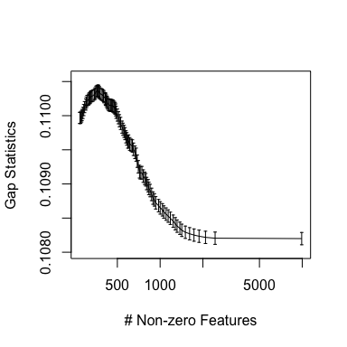
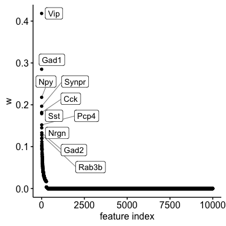
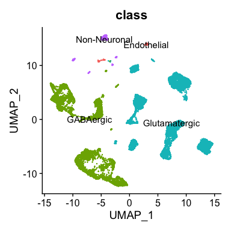
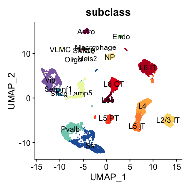
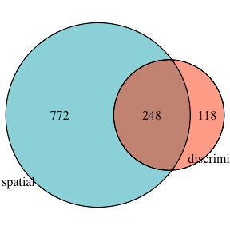
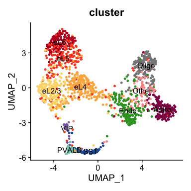
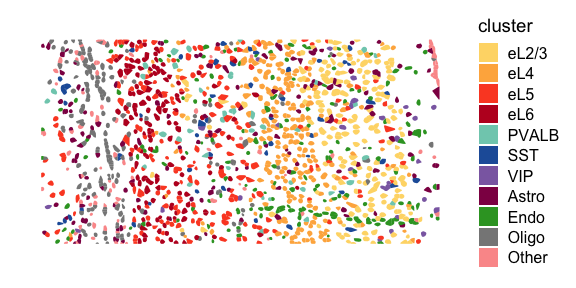
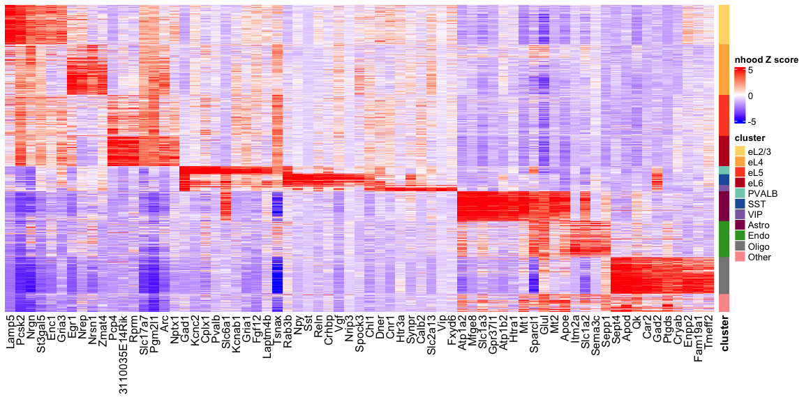

RECOBMINE selects unbiased marker panel from scRNA-seq data for targeted
spatial transcriptomics
================

This tutorial introduces you to apply RECOMBINE to a scRNA dataset for
selecting an optimized set of discriminant markers, which is then used
as a gene panel to discriminate cells of the matched tissue in targeted
spatial transcriptomics profiling. Furthermore, from discriminant
markers, RECOMBINE extracts recurrent composite markers (RCMs) to
characterize cell subpopulations. Here, we use a scRNA-seq dataset of
mouse visual cortex from Allen Brain Atlas (Tasic et al. Nature, 2018),
and for the targeted spatial transcriptomics data of the matched tissue,
we use a SRARmap dataset originally published in Wang et al. Science,
2018.

To facilitate running this tutorial without the need of downloading the
original datasets, we have provided precomputed data objects at
<https://github.com/korkutlab/recombine_datasets>. Please download and
put the directory mvc_data_precomp under the current working directory.

``` r
library(recombine)
library(tidyverse)
library(Seurat)
library(ggpubr)
library(ComplexHeatmap)
library(circlize)
library(VennDiagram)
```

## Data preprocessing

The following function gives details of the scRNA data preprocessing,
which filters out low quality cells, normalizes expressions of all
cells, and generates expressions of pseudo-cells that are used for
selecting discriminant markers by SHC-SSL. To run this function, we need
to download the scRNA dataset of mouse visual cortex from Allen Brain
Atlas
(<http://celltypes.brain-map.org/api/v2/well_known_file_download/694413985>).

After uncompressing the downloaded file, put the following files in the
directory called data/scRNA under the current directory.

-   mouse_VISp_2018-06-14_exon-matrix.csv

-   mouse_VISp_2018-06-14_genes-rows.csv

-   mouse_VISp_2018-06-14_samples-columns.csv

Without downloading the original dataset, we can load the preprocessed
data object in the directory mvc_data_precomp.

``` r
mvc_scRNA_data_preprocess <- function() {
  # expression
  tb <- read_csv("./data/scRNA/mouse_VISp_2018-06-14_exon-matrix.csv")
  colnames(tb)[1] <- "gene_entrez_id"
  tb_data <- tb
  
  # get gene names
  tb <- read_csv("./data/scRNA/mouse_VISp_2018-06-14_genes-rows.csv")
  stopifnot(all.equal(tb_data$gene_entrez_id, tb$gene_entrez_id))
  tb_data$gene_symbol <- tb$gene_symbol
  
  tb_data <- tb_data %>%
    select(-gene_entrez_id) %>%
    select(gene_symbol, everything())
  
  # transpose
  mt <- as.matrix(tb_data[, -1])
  rownames(mt) <- tb_data$gene_symbol
  mt <- t(mt)
  tb_data <- tibble(cell = rownames(mt)) %>%
    bind_cols(as_tibble(mt))
  
  # anno
  tb <- read_csv("./data/scRNA/mouse_VISp_2018-06-14_samples-columns.csv")
  stopifnot(all.equal(tb_data$cell, tb$sample_name))
  tb <- tb %>%
    rename(cell = sample_name)
  tb_anno <- tb
  
  # filter low quality cells
  low_quality = c('No Class', 'Low Quality')
  tb_anno <- tb_anno %>%
    filter(!(class %in% low_quality) &
             !(subclass %in% low_quality) &
             !(cluster %in% low_quality))
  
  tb_anno <- tb_anno[, c("cell",
                         "class",
                         "subclass",
                         "cluster",
                         "seq_batch")]
  
  tb_data <- tb_data %>%
    filter(cell %in% tb_anno$cell)
  
  # generate normalized data --------
  # Initialize the Seurat object
  mt <- as.matrix(tb_data[, -1])
  rownames(mt) <- tb_data$cell
  mt <- t(mt)
  
  # replace _ with a specical character b/c Seurat Feature names cannot have underscores ('_')
  rownames(mt) <- rownames(mt) %>%
    str_replace_all("_", "#")
  
  sobj <- CreateSeuratObject(counts = mt,
                             project = "mvc",
                             min.features = 0,
                             min.cells = 0)
  sobj
  
  # add cell annotation
  stopifnot(all.equal(rownames(sobj@meta.data), tb_anno$cell))
  sobj@meta.data <- sobj@meta.data %>%
    cbind(tb_anno[, -1] %>% as.data.frame())
  
  # Normalizing the data
  sobj <- NormalizeData(sobj, normalization.method = "LogNormalize", scale.factor = 10000)
  
  # identify top 10K hvg
  sobj <- FindVariableFeatures(sobj, selection.method = "vst", nfeatures = 10000)
  hvg10k <- (VariableFeatures(sobj))
  
  # expressions of top 10K hvg for each cell
  mt <- sobj@assays$RNA@data[hvg10k, ]
  mt <- mt %>%
    as.matrix() %>%
    t()
  rownames(mt) <- rownames(mt) %>%
    str_replace_all("#", "_")
  tb_data <- tibble(cell = rownames(mt)) %>%
    bind_cols(as_tibble(mt))
  
  # generate pseudo-cell data --------
  # identify top 2000 hvg
  sobj <- FindVariableFeatures(sobj, selection.method = "vst", nfeatures = 2000)
  
  # Scaling the data
  all.genes <- rownames(sobj)
  sobj <- ScaleData(sobj, features = all.genes)
  
  # Perform linear dimensional reduction
  n_dim <- 50
  sobj <- RunPCA(sobj, features = VariableFeatures(object = sobj), npcs = n_dim)
  
  # use leiden clustering to find microclusters with high resolution
  sobj <- FindNeighbors(sobj,
                        dims = 1:n_dim,
                        verbose = FALSE)
  sobj <- FindClusters(sobj,
                       algorithm = 4,
                       resolution = 50,
                       group.singletons = FALSE)
  
  # cluster IDs of cells
  cl <- Idents(sobj) %>%
    as.character() %>%
    paste0("c", .)
  names(cl) <- names(Idents(sobj))
  
  # remove singletons
  cl <- cl[cl != "csingleton"]
  
  nc <- cl %>% unique() %>% length()
  
  # get expr for pseudo-cells using mean of contained cells
  mt <- as.matrix(tb_data[, -1])
  rownames(mt) <- tb_data$cell
  
  mt <- scale(mt, scale = FALSE)
  mt <- mt/sd(as.double(mt))
  
  tb_all <- tibble(gene = colnames(mt))
  clusters <- unique(cl)
  for (cname in clusters) {
    cells <- names(cl)[cl == cname]
    tb <- tibble(gene = colnames(mt)) %>%
      bind_cols(tibble(expr = colMeans(mt[cells, , drop = FALSE])))
    colnames(tb)[2] <- cname
    
    tb_all <- tb_all %>%
      left_join(tb, by = "gene")
  }
  
  # transpose
  mt <- as.matrix(tb_all[, -1])
  rownames(mt) <- tb_all$gene
  
  mt <- t(mt)
  
  tb <- tibble(cell = rownames(mt)) %>%
    bind_cols(as_tibble(mt))
  
  # sort pseudo-cells according to clusters
  tb <- tb %>%
    mutate(cluster = str_replace(cell, "^c", "")) %>%
    mutate(cluster = ifelse(grepl("singleton", cluster),
                            NA,
                            cluster)) %>%
    mutate(cluster = as.integer(cluster)) %>%
    arrange(cluster) %>%
    select(-cluster)
  
  tb_pseudocell <- tb %>%
    rename(pseudo_cell = cell)
  
  tb_pseudocell_member <- tb_pseudocell %>%
    select(pseudo_cell) %>%
    left_join(tibble(cell = names(cl),
                     pseudo_cell = cl), by = "pseudo_cell")
  
  # return preprocessed data
  d <- list(data = tb_data,
            anno = tb_anno,
            data_pseudocell = tb_pseudocell,
            anno_pseudocell_member = tb_pseudocell_member)
  return(d)
}
# scRNA_data <- mvc_scRNA_data_preprocess()
```

The following function gives details of the spatial data preprocessing.
To run the function, we need to download the a STARmap dataset of 1020
genes mapped in mouse primary visual cortex
(<https://www.dropbox.com/sh/f7ebheru1lbz91s/AADm6D54GSEFXB1feRy6OSASa/visual_1020/20180505_BY3_1kgenes>).

After the download, put the following files in the directory called
data/spatial under the current directory.

-   cell_barcode_names.csv

-   cell_barcode_count.csv

-   genes.csv

-   labels.npz

The spatial location coordinate of each cell can be extracted from
labels.npz according to the method provided by the original paper of
STARmap (Want et al. Science, 2018), resulting in two coordinate files
(centroids.tsv and qhulls.tsv) that can be loaded in Seurat to visualize
a spatial map of the tissue.

Without downloading the original dataset, we can load the preprocessed
data object in the directory mvc_data_precomp.

``` r
mvc_spatial_data_preprocess <- function() {
  # data
  tb <- read_csv("./data/spatial/cell_barcode_names.csv", col_names = FALSE)
  colnames(tb)[3] <- "gene_symbol"
  tb_gene <- tb[, 3]
  
  tb <- read_csv("./data/spatial/cell_barcode_count.csv", col_names = FALSE)
  colnames(tb) <- tb_gene$gene_symbol
  tb <- tb %>%
    mutate(cell = paste0("c", 0:(nrow(tb) - 1))) %>%
    select(cell, everything())
  tb_data <- tb
  
  # use common genes with scRNA data
  tb <- read_csv("./data/scRNA/mouse_VISp_2018-06-14_genes-rows.csv")
  cmg <- intersect(tb$gene_symbol, tb_gene$gene_symbol) %>% sort()
  tb_gene <- tb_gene %>%
    mutate(profiled_in_scRNA = ifelse(gene_symbol %in% cmg, "Yes", "No"))
  
  tb_data <- tb_data[, c("cell", cmg)]
  
  # anno
  tb <- read_tsv("./mvc_data_precomp/spatial_data_cell_annotations.tsv")
  tb_anno <- tb
  
  tb_anno <- tb_data %>%
    select(cell) %>%
    left_join(tb_anno, by = "cell")
  
  # Normalizing the data
  mt <- as.matrix(tb_data[, -1])
  rownames(mt) <- tb_data$cell
  
  sobj <- CreateSeuratObject(counts = t(mt),
                             project = "mvc",
                             min.features = 0,
                             min.cells = 0)
  sobj <- NormalizeData(sobj, normalization.method = "LogNormalize", scale.factor = 100)
  
  # expressions for each cell
  mt <- sobj@assays$RNA@data
  mt <- mt %>%
    as.matrix() %>%
    t()
  
  tb_data <- tibble(cell = rownames(mt)) %>%
    bind_cols(as_tibble(mt))
  
  # return preprocessed data
  d <- list(data = tb_data,
            anno = tb_anno,
            gene = tb_gene)
  return(d)
}
# spatial_data <- mvc_spatial_data_preprocess()
```

Here, we load the preprocessed data objects in the directory
mvc_data_precomp to ensure reproducibility (i.e., slightly differently
processed data objects may be generated by different versions of
dependent packages).

``` r
scRNA_data <- c(readRDS("./mvc_data_precomp/preprocessed_scRNA_data.rds"),
                readRDS("./mvc_data_precomp/preprocessed_scRNA_data_pseudocell.rds"))
spatial_data <- readRDS("./mvc_data_precomp/preprocessed_spatial_data.rds")
```

## scRNA data: select discriminant markers

Now we apply SHC_SSL to the scRNA data for unbiased selection of
discriminant markers. SHC_SSL employs a spike-and-slab lasso penalty,
which contains two hyperparameters: the spike variance parameter λ_0 and
the slab variance parameter λ_1. We keep λ_1 to a small constant, and
tune λ_0 during hyperparameter selection. To select the optimal value of
λ_0, we employ a permutation based approach, the gap statistic. Given a
hyperparameter λ_0, the gap statistic measures the strength of the
clustering based on real data with respect to the one based on randomly
permuted data that are supposed to have no cluster. The λ_0 of the
maximum gap statistic is considered as the optimized value of λ_0 to
enforce sparsity and select an optimized set of discriminant features.
The selection of the optimal hyperparameter is the most costly
computation in RECOMBINE.

``` r
# use pseudo-cell to reduce computational cost of SHC-SSL
mt_expr <- as.matrix(scRNA_data$data_pseudocell[, -1])
rownames(mt_expr) <- scRNA_data$data_pseudocell$pseudo_cell

# center for each feature
mt_expr <- scale(mt_expr, scale = FALSE)

# scale so that the overall variance is unit 
mt_expr <- mt_expr/sd(as.double(mt_expr))

# # run SHC_SSL
# nperms = 10
# lambda1 <- 0.0001
# lambda0s <- seq(0.001, 4000, length = 100)
# 
# # this takes a long time
# out <- SelectCF_gapstat(x = mt_expr,
#                         nperms = nperms,
#                         lambda0s = lambda0s,
#                         lambda1 = lambda1)
# save(out, file = "scRNA_shc_ssl_out.rda")

# We load the pre-computed result to save compute time
out <- readRDS("./mvc_data_precomp/scRNA_shc_ssl_out.rds")
```

Plot gap statistic profile as a function of the number of selected
features.

``` r
plot(out$w_l0norm,
     out$gaps_mean,
     log = "x",
     xlab = "# Non-zero Features",
     ylab = "Gap Statistics",
     ylim = c(min(out$gaps_mean - out$gaps_se) - 0.0001,
              max(out$gaps_mean + out$gaps_se) + 0.0001),
     type = "l",
     lwd = 1)
arrows(x0 = out$w_l0norm,
       y0 = out$gaps_mean - out$gaps_se,
       x1 = out$w_l0norm,
       y1 = out$gaps_mean + out$gaps_se,
       code = 3, angle = 90, length = 0.02, lwd = 1)
```

<!-- -->

With the optimal hyperparameter corresponding to the maximum gap
statistic, RECOMBINE selects the discriminant markers as features with
nonzero weights. Now, we get nonzero weights of the discriminant
markers.

``` r
w <- out$result$w
names(w) <- colnames(mt_expr)

w <- sort(w, decreasing = TRUE)
w_nonzero <- w[w > 0]
```

A point plot of feature weights in a decreasing order.

``` r
tb <- tibble(feature = names(w),
             w = w)
tb <- tb %>%
  mutate(i = 1:nrow(tb)) %>%
  mutate(label = ifelse(i <= 10, feature, ""))

options(ggrepel.max.overlaps = Inf)
ggline(tb, "i", "w",
            xlab = "feature index",
            label = "label",
            repel = TRUE,
            label.rectangle = TRUE,
            point.size = 0.1,
            plot_type = "p")
```

<!-- -->

## scRNA data: UMAP projection based on discriminant markers

The discriminant markers are a optimized set of features that
hierarchically distinguish individual cells with high granularity. Based
on the expressions of the discriminant markers, we employ Seurat to
perform UMAP projection of the dataset.

``` r
scRNA_embed <- function(mt_expr) {
  # Initialize the Seurat object
  sobj <- CreateSeuratObject(counts = t(mt_expr[, names(w_nonzero)]),
                             project = "mvc",
                             min.features = 0,
                             min.cells = 0)
  
  # add cell annotation
  stopifnot(all.equal(rownames(sobj@meta.data), scRNA_data$anno$cell))
  sobj@meta.data <- sobj@meta.data %>%
    cbind(scRNA_data$anno[, -1] %>% as.data.frame())
  
  # set variable genes as all discriminant markers
  VariableFeatures(sobj) <- rownames(sobj)
  
  # Scaling the data
  sobj <- ScaleData(sobj, features = rownames(sobj))
  
  # Perform linear dimensional reduction
  sobj <- RunPCA(sobj)
  
  # umap
  sobj <- RunUMAP(sobj,
                  dims = 1:50,
                  verbose = FALSE)
  
  return(sobj)
}
# sobj <- scRNA_embed(mt_expr)

# we load the pre-computed result to ensure reproducibility 
sobj <- readRDS("./mvc_data_precomp/scRNA_seu_obj.rds")
```

Visualize cell types on UMAPs.

``` r
DimPlot(sobj, group.by = "class", label = TRUE) +
  NoLegend() +
  ggtitle("class")
```

<!-- -->

``` r
tb <- read_tsv("./mvc_data_precomp/scRNA_celltype_colors.tsv")
#> Rows: 23 Columns: 3
#> ── Column specification ────────────────────────────────────────────────────────
#> Delimiter: "\t"
#> chr (3): class, subclass, color
#> 
#> ℹ Use `spec()` to retrieve the full column specification for this data.
#> ℹ Specify the column types or set `show_col_types = FALSE` to quiet this message.
col <- tb$color
names(col) <- tb$subclass
sobj$subclass <- factor(sobj$subclass, levels = names(col))

DimPlot(sobj, group.by = "subclass", cols = col, label = TRUE) +
  NoLegend() +
  ggtitle("subclass")
```

<!-- -->

## Compare discriminant markers with spatially profiled genes

Visualize the overlap between the discriminant markers from the scRNA
data and the profiled genes from the spatial data

``` r
discr_markers <- names(w_nonzero)
spatial_genes <- spatial_data$gene$gene_symbol

# Helper function to display VennDiagram
display_venn <- function(x, ...){
  library(VennDiagram)
  grid.newpage()
  venn_object <- venn.diagram(x, filename = NULL, disable.logging = TRUE, ...)
  grid.draw(venn_object)
}

display_venn(list( discriminant = discr_markers,
                   spatial = spatial_genes),
             fill = c("#FC4E07", "#00AFBB"),
             alpha = c(0.5, 0.5),
             lwd = 1,
             col = "black")
```

<!-- -->

    #> INFO [2023-07-04 15:53:43] [[1]]
    #> INFO [2023-07-04 15:53:43] x
    #> INFO [2023-07-04 15:53:43] 
    #> INFO [2023-07-04 15:53:43] $filename
    #> INFO [2023-07-04 15:53:43] NULL
    #> INFO [2023-07-04 15:53:43] 
    #> INFO [2023-07-04 15:53:43] $disable.logging
    #> INFO [2023-07-04 15:53:43] [1] TRUE
    #> INFO [2023-07-04 15:53:43] 
    #> INFO [2023-07-04 15:53:43] [[4]]
    #> INFO [2023-07-04 15:53:43] ...
    #> INFO [2023-07-04 15:53:43]

We use the overlapped discriminant markers as a gene panel for spatial
data.

``` r
overlapped_markers <- intersect(discr_markers, spatial_genes)
spatial_data$data <- spatial_data$data[, c("cell", overlapped_markers)]

mt_expr <- as.matrix(spatial_data$data[, -1])
rownames(mt_expr) <- spatial_data$data$cell
```

After exploring the cell types profiled in the spatial data, we found an
extra cell type, microglia, that are not covered in the scRNA data.
Since the discriminant markers are selected based on the scRNA data, we
wouldn’t expect these markers can discriminate microglia from other cell
types. Thus, we filter out microglia before the clustering and embedding
of the spatial data based on the overlapped discriminant markers.

``` r
spatial_data$anno <- spatial_data$anno %>%
  filter(celltype != "Micro")

spatial_data$data <- spatial_data$data %>%
  filter(cell %in% spatial_data$anno$cell)

mt_expr <- mt_expr[spatial_data$data$cell, ]
```

## Spatial data: Leiden clustering and UMAP projection based on the overlapped discriminant markers

Based on the expressions of the overlapped discriminant markers, we
employ Seurat to perform Leiden clustering and UMAP projection of the
dataset.

``` r
spatial_embed_clust <- function(mt_expr) {
  # Initialize the Seurat object
  sobj <- CreateSeuratObject(counts = t(mt_expr),
                             project = "mvc",
                             min.features = 0,
                             min.cells = 0)
  
  # set variable genes as all discriminant markers
  VariableFeatures(sobj) <- rownames(sobj)
  
  # Scaling the data
  sobj <- ScaleData(sobj, features = rownames(sobj))
  
  # Perform linear dimensional reduction
  sobj <- RunPCA(sobj, features = VariableFeatures(object = sobj))
  
  # umap
  sobj <- RunUMAP(sobj,
                  dims = 1:10,
                  verbose = FALSE)
  
  # use leiden clustering to find clusters
  sobj <- FindNeighbors(sobj,
                        dims = 1:10,
                        verbose = FALSE)
  sobj <- FindClusters(sobj,
                       algorithm = 4, # leiden
                       resolution = 0.5)

  return(sobj)
}
# sobj <- spatial_embed_clust(mt_expr)

# we load the pre-computed result to ensure reproducibility 
# In the pre-computed result, we also further sub-clustered excitatory, inhibitory, and non-neuronal compartments and annotate clusters based on marker expressions.
sobj <- readRDS("./mvc_data_precomp/spatial_seu_obj.rds")
```

Visualize cell clusters on UMAPs.

``` r
tb <- read_tsv("./mvc_data_precomp/spatial_cluster_colors.tsv")
#> Rows: 11 Columns: 2
#> ── Column specification ────────────────────────────────────────────────────────
#> Delimiter: "\t"
#> chr (2): cluster, color
#> 
#> ℹ Use `spec()` to retrieve the full column specification for this data.
#> ℹ Specify the column types or set `show_col_types = FALSE` to quiet this message.
col_clusters <- tb$color
names(col_clusters) <- tb$cluster
sobj$cluster <- factor(sobj$cluster, levels = names(col_clusters))

DimPlot(sobj, group.by = "cluster", label = TRUE,
        cols = col_clusters) +
  NoLegend()
```

<!-- -->

Visualize cell clusters on the physical map of spatial locations.

``` r
mvc_spatial_location <- function() {
  loc_sobj <- LoadSTARmap("./data/spatial/")
  cells <- paste0("c", 0:(ncol(loc_sobj) - 1))
  loc_sobj <- RenameCells(loc_sobj, new.names = cells)
  rownames(loc_sobj@meta.data) <- cells
  
  return(loc_sobj)
}
# loc_sobj <- mvc_spatial_location()

# we load the pre-computed location object
loc_sobj <- readRDS("./mvc_data_precomp/spatial_loc_seu_obj.rds")

# filter cells that are clustered above
loc_sobj <- loc_sobj[, colnames(loc_sobj) %in% colnames(sobj)]

# spatial map of cell clusters
stopifnot(all.equal(colnames(loc_sobj), colnames(sobj)))
loc_sobj$cluster <- sobj$cluster

SpatialPlot(loc_sobj, group.by = "cluster",
            cols = col_clusters)
```

<!-- -->

## Spatial data: RCMs at the cell and cluster levels

From the discriminant markers and a K nearest neighbor graph of cells,
RECOMBINE extracts RCMs at the cell level using neighborhood recurrence
test.

``` r
# K nearest neighbors graph from Seurat
mt_nn <- sobj@graphs$RNA_nn %>% as.matrix()

k_cells <- sum(mt_nn[1, ] > 0)
stopifnot(all(rowSums(mt_nn > 0) == k_cells))

# check if cell names are consistent
stopifnot(all.equal(rownames(mt_nn), colnames(mt_nn)))
stopifnot(all.equal(rownames(mt_expr), rownames(mt_nn)))

# Extract RCMs at the cell level using neighborhood recurrence test
tb_rcm_cell <- nhood_recur_test(mt_expr[, overlapped_markers], mt_nn)
```

Further, based on the RCMs at the cell level and grouping of cells into
subpopulations, RECOMBINE extracts RCMs at the cell subpopulation level.

``` r
# Extract RCMs at the cluster level
tb_clust <- tibble::tibble(cell = rownames(sobj@meta.data),
                           cluster = sobj@meta.data$cluster)
tb_rcm_cluster <- get_rcm_subpop(tb_rcm_cell, 
                                 tb_clust)
```

Plot a heatmap of RCMs across clusters, within each of which cells are
hierarchically clustered.

``` r
# hierarchical clustering within leiden clusters
get_hc <- function(w, mt) {
  stopifnot(length(setdiff(names(w), colnames(mt))) == 0)
  # calculate dissimilarity as squared distance
  mt_w <- matrix(rep(w, each = nrow(mt)), nrow = nrow(mt))
  d <- dist(sqrt(mt_w)*mt[, names(w)])**2
  hc <- hclust(d, method = "average")
  return(hc)
}

# sort cells
clusters <- levels(tb_clust$cluster)
tb_cell_sorted <- tibble()
for (cl in clusters) {
  mt_sub <- mt_expr[tb_clust$cell[tb_clust$cluster == cl], overlapped_markers]
  hc <- get_hc(w_nonzero[overlapped_markers], mt_sub)
  
  sorted_cells <- hc$labels[hc$order]
  tb_cell_sorted <- tb_cell_sorted %>%
    bind_rows(tibble(cell = sorted_cells,
                     cluster = cl))
}

# get top recurrent markers in each cluster
n_top <- 10
markers <- tb_rcm_cluster %>%
  filter(fract_signif_cells > 0.5) %>%
  filter(avg_nhood_zscore > 0) %>%
  arrange(cluster, desc(fract_signif_cells)) %>%
  group_by(cluster) %>%
  slice(1:n_top) %>%
  ungroup() %>% 
  .$marker %>%
  unique()

# sort markers based on relative expression across clusters
markers <- tb_rcm_cluster %>%
  filter(marker %in% markers) %>%
  arrange(desc(fract_signif_cells*sign(avg_nhood_zscore))) %>%
  distinct(marker, .keep_all = TRUE) %>%
  arrange(cluster) %>%
  .$marker %>%
  unique()

# convert nhood z score matrix
df <- tb_rcm_cell %>% 
  select(cell, marker, nhood_zscore) %>%
  spread("marker", "nhood_zscore")

mt_zscore <- as.matrix(df[, -1])
rownames(mt_zscore) <- df$cell

# plot hm
col <- colorRamp2(c(-5, 0, 5),
                  c("blue", "white", "red"))
ht <- Heatmap(mt_zscore[tb_cell_sorted$cell, markers],
              name = "nhood Z score",
              col = col,
              cluster_rows = FALSE,
              cluster_columns = FALSE,
              show_column_dend = FALSE,
              show_row_names = FALSE)

mt_anno <- tb_clust %>%
  select(cluster) %>%
  as.matrix()
rownames(mt_anno) <- tb_clust$cell
ht2 <- Heatmap(mt_anno[tb_cell_sorted$cell, ], name = "cluster",
               col = col_clusters,
               na_col = "white",
               width = unit(4, "mm"),
               show_row_names = FALSE,
               row_names_gp = gpar(fontsize = 5, fontface = "bold"),
               show_column_names = TRUE,
               column_names_gp = gpar(fontsize = 12, fontface = "bold"),
               column_title = NULL,
               column_title_rot = 90,
               column_title_gp = gpar(fontsize = 10, fontface = "bold"),
               column_title_side = "bottom")
ht <- ht + ht2
draw(ht, newpage = FALSE)
```

<!-- -->

## Session information

``` r
sessionInfo()
#> R version 4.1.2 (2021-11-01)
#> Platform: x86_64-apple-darwin17.0 (64-bit)
#> Running under: macOS Big Sur 10.16
#> 
#> Matrix products: default
#> BLAS:   /Library/Frameworks/R.framework/Versions/4.1/Resources/lib/libRblas.0.dylib
#> LAPACK: /Library/Frameworks/R.framework/Versions/4.1/Resources/lib/libRlapack.dylib
#> 
#> locale:
#> [1] en_US.UTF-8/en_US.UTF-8/en_US.UTF-8/C/en_US.UTF-8/en_US.UTF-8
#> 
#> attached base packages:
#> [1] grid      stats     graphics  grDevices utils     datasets  methods  
#> [8] base     
#> 
#> other attached packages:
#>  [1] VennDiagram_1.7.3     futile.logger_1.4.3   circlize_0.4.13      
#>  [4] ComplexHeatmap_2.10.0 ggpubr_0.4.0          SeuratObject_4.0.4   
#>  [7] Seurat_4.1.0          forcats_0.5.1         stringr_1.4.0        
#> [10] dplyr_1.0.7           purrr_0.3.4           readr_2.1.0          
#> [13] tidyr_1.1.4           tibble_3.1.6          ggplot2_3.3.5        
#> [16] tidyverse_1.3.1       recombine_1.0        
#> 
#> loaded via a namespace (and not attached):
#>   [1] readxl_1.3.1          backports_1.3.0       plyr_1.8.6           
#>   [4] igraph_1.2.8          lazyeval_0.2.2        splines_4.1.2        
#>   [7] listenv_0.8.0         scattermore_0.7       digest_0.6.28        
#>  [10] foreach_1.5.1         htmltools_0.5.2       fansi_0.5.0          
#>  [13] magrittr_2.0.1        tensor_1.5            cluster_2.1.2        
#>  [16] doParallel_1.0.16     ROCR_1.0-11           tzdb_0.2.0           
#>  [19] globals_0.14.0        modelr_0.1.8          matrixStats_0.61.0   
#>  [22] vroom_1.5.6           spatstat.sparse_3.0-0 colorspace_2.0-2     
#>  [25] rvest_1.0.2           ggrepel_0.9.1         haven_2.4.3          
#>  [28] xfun_0.28             crayon_1.4.2          jsonlite_1.7.2       
#>  [31] spatstat.data_3.0-0   iterators_1.0.13      survival_3.2-13      
#>  [34] zoo_1.8-9             glue_1.5.0            polyclip_1.10-0      
#>  [37] gtable_0.3.0          leiden_0.3.9          GetoptLong_1.0.5     
#>  [40] car_3.0-12            shape_1.4.6           future.apply_1.8.1   
#>  [43] BiocGenerics_0.40.0   abind_1.4-5           scales_1.1.1         
#>  [46] futile.options_1.0.1  DBI_1.1.1             rstatix_0.7.0        
#>  [49] miniUI_0.1.1.1        Rcpp_1.0.7            viridisLite_0.4.0    
#>  [52] xtable_1.8-4          clue_0.3-60           reticulate_1.22      
#>  [55] spatstat.core_2.3-1   bit_4.0.4             stats4_4.1.2         
#>  [58] htmlwidgets_1.5.4     httr_1.4.2            RColorBrewer_1.1-2   
#>  [61] ellipsis_0.3.2        ica_1.0-2             farver_2.1.0         
#>  [64] pkgconfig_2.0.3       uwot_0.1.10           dbplyr_2.1.1         
#>  [67] deldir_1.0-6          utf8_1.2.2            labeling_0.4.2       
#>  [70] tidyselect_1.1.1      rlang_0.4.12          reshape2_1.4.4       
#>  [73] later_1.3.0           munsell_0.5.0         cellranger_1.1.0     
#>  [76] tools_4.1.2           cli_3.1.0             generics_0.1.1       
#>  [79] broom_0.7.10          ggridges_0.5.3        evaluate_0.14        
#>  [82] fastmap_1.1.0         yaml_2.2.1            goftest_1.2-3        
#>  [85] bit64_4.0.5           knitr_1.36            fs_1.5.0             
#>  [88] fitdistrplus_1.1-6    RANN_2.6.1            pbapply_1.5-0        
#>  [91] future_1.23.0         nlme_3.1-153          mime_0.12            
#>  [94] formatR_1.11          xml2_1.3.2            compiler_4.1.2       
#>  [97] rstudioapi_0.13       plotly_4.10.0         png_0.1-7            
#> [100] ggsignif_0.6.3        spatstat.utils_3.0-1  reprex_2.0.1         
#> [103] stringi_1.7.5         highr_0.9             lattice_0.20-45      
#> [106] Matrix_1.3-4          vctrs_0.3.8           pillar_1.6.4         
#> [109] lifecycle_1.0.1       GlobalOptions_0.1.2   spatstat.geom_3.0-6  
#> [112] lmtest_0.9-39         RcppAnnoy_0.0.19      data.table_1.14.2    
#> [115] cowplot_1.1.1         irlba_2.3.3           httpuv_1.6.3         
#> [118] patchwork_1.1.1       R6_2.5.1              promises_1.2.0.1     
#> [121] KernSmooth_2.23-20    gridExtra_2.3         IRanges_2.28.0       
#> [124] parallelly_1.28.1     codetools_0.2-18      lambda.r_1.2.4       
#> [127] MASS_7.3-54           assertthat_0.2.1      rjson_0.2.20         
#> [130] withr_2.4.2           sctransform_0.3.3     S4Vectors_0.32.2     
#> [133] mgcv_1.8-38           parallel_4.1.2        hms_1.1.1            
#> [136] rpart_4.1-15          rmarkdown_2.11        carData_3.0-4        
#> [139] Rtsne_0.15            shiny_1.7.1           lubridate_1.8.0
```
