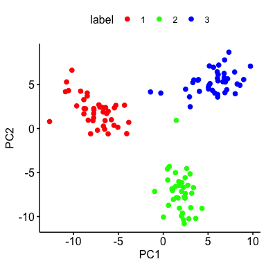
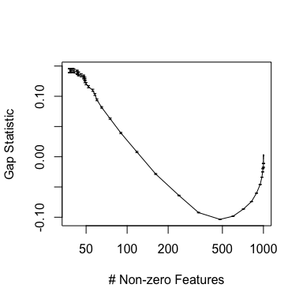
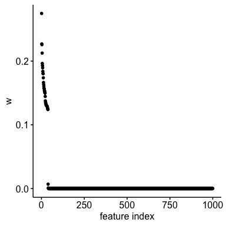
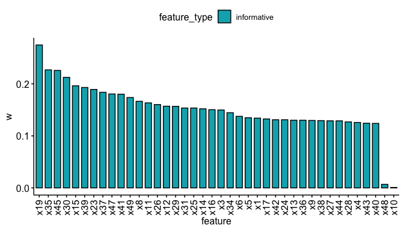
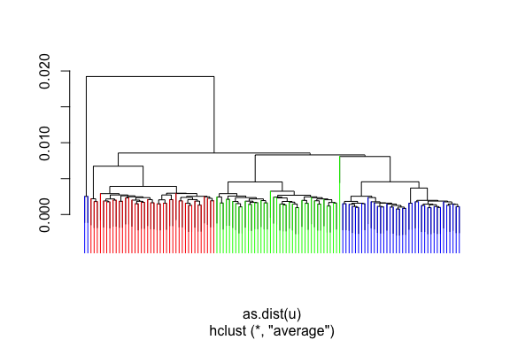
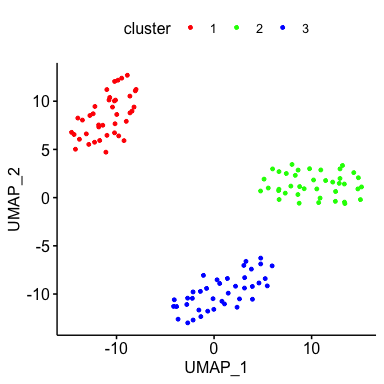
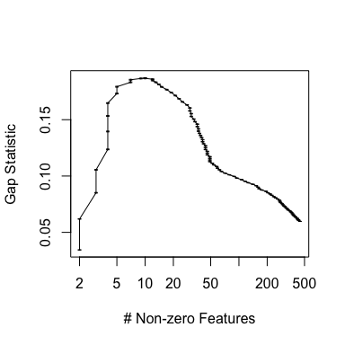
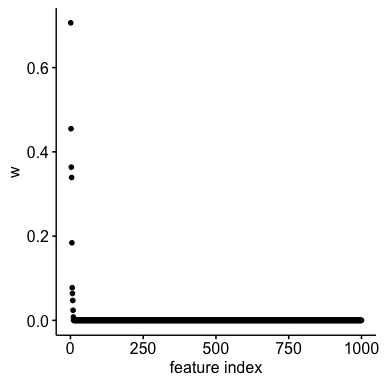
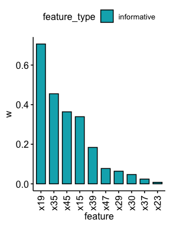
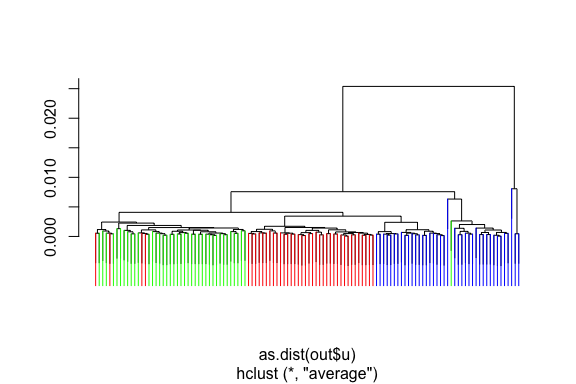

RECOMBINE SHC-SSL performs accurate feature selection coupled with
hierarchical clustering
================

This document introduces you to use the SHC-SSL of RECOMBINE. We apply
this algorithm to a simulation dataset for accurate feature selection
coupled with hierarchical clustering. It results in an optimized set of
discriminant features with nonzero weights and a dissimilarity matrix
whose entries are pairwise distances between samples. The dissimilarity
matrix is then subjected to clustering and dimension reduction
algorithms such as hierarchical clustering, Leiden clustering, and UMAP
projection.

``` r
library(recombine)
library(tidyverse)
library(ggpubr)
library(sparcl)
library(igraph)
library(uwot)
```

## Generate simulation data

We generate a simulation dataset, which has 120 samples characterized by
1000 features, including 50 informative features (the top 50 features)
and 950 noise features (the rest of features. Each sample comes from one
of 3 clusters, each of which has 40 samples. Samples of each cluster are
fully described by the informative features, which follows a
multivariate normal distribution. The noise features are independent and
identically distributed from the standard normal distribution.

``` r
# source(system.file("scripts", "gen_sim_data.R", package = "recombine"))
# d <- gen_sim_data(size_clusters = c(40, 40, 40),
#                   p_inf = 50,
#                   p_noise = 950,
#                   iseed = 1)
```

Here, we load a pre-generated example simulation data from internal data
of the recombine package.

``` r
d <- example_sim_data
d %>% names()
#> [1] "x" "y"
d$y %>% table()
#> .
#>  1  2  3 
#> 40 40 40
```

Perform PCA and visualize data in PC space.

``` r
res.pca <- prcomp(d$x)
tb <- tibble(label = factor(as.character(d$y), levels = as.character(1:3))) %>%
  bind_cols(as_tibble(as.matrix(res.pca$x[, 1:2])))

ggscatter(tb, x = "PC1", y = "PC2",
          color = "label",
          palette = c("red", "green", "blue"))
```

<!-- -->

## Run SHC-SSL to do feature selection coupled with hierarchical clustering

We run SHC-SSL on the above dataset for feature selection coupled with
hierarchical clustering. SHC-SSL employs a spike-and-slab lasso penalty,
which contains two hyperparameters: the spike variance parameter λ_0 and
the slab variance parameter λ_1. We keep λ_1 to a small constant, and
tune λ_0 during hyperparameter selection. To select the optimal value of
λ_0, we employ a permutation based approach, the gap statistic. Given a
hyperparameter λ_0, the gap statistic measures the strength of the
clustering based on real data with respect to the one based on randomly
permuted data that are supposed to have no cluster. The λ_0 of the
maximum gap statistic is considered as the optimized value of λ_0 to
enforce sparsity and select an optimized set of discriminant features.

``` r
# To save time, one may reduce (1) the search space of lambda0s or (2) the number of permutations.
# We observed the gap statistic is not sensitive to different permuted data, so we only use 3 permutations here.
out <- SHC_SSL_gapstat(d$x,
                       lambda0s = seq(0.01, 500, length = 100),
                       lambda1 = 0.001,
                       nperms = 3)
#> Running on unpermuted data
#> 123456789101112131415161718192021222324252627282930313233343536373839404142434445464748495051525354555657585960616263646566676869707172737475767778798081828384858687888990919293949596979899100
#> Running on permuted data
#> Permutation  1  of  3
#> 123456789101112131415161718192021222324252627282930313233343536373839404142434445464748495051525354555657585960616263646566676869707172737475767778798081828384858687888990919293949596979899100
#> Permutation  2  of  3
#> 123456789101112131415161718192021222324252627282930313233343536373839404142434445464748495051525354555657585960616263646566676869707172737475767778798081828384858687888990919293949596979899100
#> Permutation  3  of  3
#> 123456789101112131415161718192021222324252627282930313233343536373839404142434445464748495051525354555657585960616263646566676869707172737475767778798081828384858687888990919293949596979899100
```

Plot gap statistic profile as a function of the number of selected
features.

``` r
plot(out$w_l0norm,
     out$gaps_mean,
     log = "x",
     xlab = "# Non-zero Features",
     ylab = "Gap Statistic",
     ylim = c(min(out$gaps_mean - out$gaps_se) - 0.0001,
              max(out$gaps_mean + out$gaps_se) + 0.0001),
     type = "l",
     lwd = 1)

arrows(x0 = out$w_l0norm,
       y0 = out$gaps_mean - out$gaps_se,
       x1 = out$w_l0norm,
       y1 = out$gaps_mean + out$gaps_se,
       code = 3, angle = 90, length = 0.02, lwd = 1)
```

<!-- -->

A point plot of feature weights in a decreasing order.

``` r
w <- out$result$w
names(w) <- colnames(d$x)
w <- sort(w, decreasing = TRUE)

tb <- tibble(feature = names(w),
             w = w)
tb <- tb %>%
  mutate(i = 1:nrow(tb))

ggline(tb, "i", "w",
       xlab = "feature index",
       point.size = 0.1,
       plot_type = "p")
```

<!-- -->

A bar plot of nonzero weights of features in a decreasing order, showing
80% of true informative features are recalled.

``` r
w <- w[w > 0]

features_inf <- paste0("x", 1:50)
tb <- tibble(feature = names(w),
             w = w,
             feature_type = ifelse(feature %in% features_inf,
                                   "informative",
                                   "noise"))

ggbarplot(tb, "feature", "w",
          fill = "feature_type",
          palette = c("#00AFBB", "#FC4E07")) + 
  rotate_x_text()
```

<!-- -->

A dendrogram plot of hierarchical clusters, showing SHC-SSL achieves an
accurate performance of hierarchical clustering.

``` r
col_labels <- rep("", length(d$y))
col_labels[d$y == 1] <- "red"
col_labels[d$y == 2] <- "green"
col_labels[d$y == 3] <- "blue"

sparcl::ColorDendrogram(out$result$hc, col_labels)
```

<!-- -->

## Leiden clustering

Besides hierarchical clustering, the resulted dissimilarity matrix based
on discriminant features can be subjected to other clustering methods
such as Leiden clustering. To be consistent with single-cell analysis
(e.g., Seurat), we use the dissimilarity matrix based on discriminant
features to build a K nearest-neighbor graph and then do Leiden
clustering.

``` r
make_knn_graph <- function(dist, k) {
  # make a list of edges to k nearest neighbors for each cell
  edges <- mat.or.vec(0,2)
  for (i in 1:nrow(dist)){
    # find closes neighbours
    matches <- setdiff(order(dist[i,],decreasing = F)[1:(k+1)],i)
    # add edges in both directions
    edges <- rbind(edges,cbind(rep(i,k),matches))  
    edges <- rbind(edges,cbind(matches,rep(i,k)))  
  }
  # create a graph from the edgelist
  graph <- igraph::graph_from_edgelist(edges,directed=F)
  return(graph)
}

g <- make_knn_graph(dist = out$result$u, k = 20)
set.seed(1)
cl <- igraph::cluster_leiden(g, resolution_parameter = 0.6)
tb_cl <- tibble(cell = rownames(d$x),
                cluster = as.character(cl$membership))
```

## UMAP projection

Finally, we use the dissimilarity matrix based on discriminant features
to project samples into 2-dimensional UMAPs.

``` r
set.seed(1)
umap_res <- uwot::umap(as.dist(out$result$u),
                       n_neighbors = 20,
                       min_dist = 2)

tb_umap <- tibble(UMAP_1 = umap_res[, 1],
                  UMAP_2 = umap_res[, 2])
tb_cl <- bind_cols(tb_cl, tb_umap)
```

Visualize Leiden clusters on UMAPs.

``` r
tb <- tb_cl %>%
  mutate(cluster = factor(cluster, 
                          levels = as.character(sort(as.integer(unique(cluster))))))

ggscatter(tb, x = "UMAP_1", y = "UMAP_2",
          size = 1,
          color = "cluster",
          palette = c("red", "green", "blue"))
```

<!-- -->

## Compare SHC-SSL with SHC

Finally, we run SHC on the same dataset so that we can compare the
results of SHC with SHC-SSL. SHC employs a lasso penalty. We use
sparcl::HierarchicalSparseCluster.permute to select an optimal
hyperparamter using a permutation based approach, the gap statistic,
followed by running sparcl::HierarchicalSparseCluster for final feature
selection and hierarchical clustering.

``` r
# To save time, one may reduce (1) the search space of wbounds or (2) the number of permutations.
# We observed the gap statistic is not sensitive to different permuted data, so we only use 3 permutations here.
shc.permute.out <- sparcl::HierarchicalSparseCluster.permute(x = d$x,
                                                             nperms = 3,
                                                             wbounds = seq(1.1, 10, len = 100))
#> Running sparse hierarchical clustering on unpermuted data
#> 123456789101112131415161718192021222324252627282930313233343536373839404142434445464748495051525354555657585960616263646566676869707172737475767778798081828384858687888990919293949596979899100
#> Running sparse hierarchical clustering on permuted data
#> Permutation  1  of  3
#> 123456789101112131415161718192021222324252627282930313233343536373839404142434445464748495051525354555657585960616263646566676869707172737475767778798081828384858687888990919293949596979899100
#> Permutation  2  of  3
#> 123456789101112131415161718192021222324252627282930313233343536373839404142434445464748495051525354555657585960616263646566676869707172737475767778798081828384858687888990919293949596979899100
#> Permutation  3  of  3
#> 123456789101112131415161718192021222324252627282930313233343536373839404142434445464748495051525354555657585960616263646566676869707172737475767778798081828384858687888990919293949596979899100
```

Plot gap statistic profile as a function of the number of selected
features.

``` r
shc.permute.out[["segaps"]] = shc.permute.out$sdgaps / ncol(shc.permute.out$permtots)
plot(shc.permute.out$nnonzerows,
     shc.permute.out$gaps,
     log = "x",
     xlab = "# Non-zero Features",
     ylab = "Gap Statistic",
     ylim = c(min(shc.permute.out$gaps - shc.permute.out$segaps) - 0.0001,
              max(shc.permute.out$gaps + shc.permute.out$segaps) + 0.0001),
     type = "l",
     lwd = 1)

arrows(x0 = shc.permute.out$nnonzerows,
       y0 = shc.permute.out$gaps - shc.permute.out$segaps,
       x1 = shc.permute.out$nnonzerows,
       y1 = shc.permute.out$gaps + shc.permute.out$segaps,
       code = 3, angle = 90, length = 0.02, lwd = 1)
```

<!-- -->

Run SHC using the optimal hyperparameter.

``` r
shc.out <- sparcl::HierarchicalSparseCluster(x = d$x,
                                             wbound = shc.permute.out$bestw)
#> 12345678910111213
```

A point plot of feature weights in a decreasing order.

``` r
w <- shc.out$ws
names(w) <- colnames(d$x)
w <- sort(w, decreasing = TRUE)

tb <- tibble(feature = names(w),
             w = w)
tb <- tb %>%
  mutate(i = 1:nrow(tb))

ggline(tb, "i", "w",
       xlab = "feature index",
       point.size = 0.1,
       plot_type = "p")
```

<!-- -->

A bar plot of nonzero weights of features in a decreasing order, showing
only 20% of true informative features are recalled. This showcases
SHC-SSL has a much better recall of true informative features compared
with SHC (80% vs. 20%).

``` r
w <- w[w > 0]

features_inf <- paste0("x", 1:50)
tb <- tibble(feature = names(w),
             w = w,
             feature_type = ifelse(feature %in% features_inf,
                                   "informative",
                                   "noise"))

ggbarplot(tb, "feature", "w",
          fill = "feature_type",
          palette = c("#00AFBB", "#FC4E07")) + 
  rotate_x_text()
```

<!-- -->

A dendrogram plot of hierarchical clusters, showing some samples are
mis-clustered in wrong clusters.

``` r
col_labels <- rep("", length(d$y))
col_labels[d$y == 1] <- "red"
col_labels[d$y == 2] <- "green"
col_labels[d$y == 3] <- "blue"

sparcl::ColorDendrogram(shc.out$hc, col_labels)
```

<!-- -->

## Session information

``` r
sessionInfo()
#> R version 4.1.2 (2021-11-01)
#> Platform: x86_64-apple-darwin17.0 (64-bit)
#> Running under: macOS Big Sur 10.16
#> 
#> Matrix products: default
#> BLAS:   /Library/Frameworks/R.framework/Versions/4.1/Resources/lib/libRblas.0.dylib
#> LAPACK: /Library/Frameworks/R.framework/Versions/4.1/Resources/lib/libRlapack.dylib
#> 
#> locale:
#> [1] en_US.UTF-8/en_US.UTF-8/en_US.UTF-8/C/en_US.UTF-8/en_US.UTF-8
#> 
#> attached base packages:
#> [1] stats     graphics  grDevices utils     datasets  methods   base     
#> 
#> other attached packages:
#>  [1] uwot_0.1.10     Matrix_1.3-4    igraph_1.2.8    sparcl_1.0.4   
#>  [5] ggpubr_0.4.0    forcats_0.5.1   stringr_1.4.0   dplyr_1.0.7    
#>  [9] purrr_0.3.4     readr_2.1.0     tidyr_1.1.4     tibble_3.1.6   
#> [13] ggplot2_3.3.5   tidyverse_1.3.1 recombine_1.0  
#> 
#> loaded via a namespace (and not attached):
#>  [1] Rcpp_1.0.7       lattice_0.20-45  lubridate_1.8.0  assertthat_0.2.1
#>  [5] digest_0.6.28    utf8_1.2.2       RSpectra_0.16-0  R6_2.5.1        
#>  [9] cellranger_1.1.0 backports_1.3.0  reprex_2.0.1     evaluate_0.14   
#> [13] highr_0.9        httr_1.4.2       pillar_1.6.4     rlang_0.4.12    
#> [17] readxl_1.3.1     rstudioapi_0.13  car_3.0-12       rmarkdown_2.11  
#> [21] labeling_0.4.2   munsell_0.5.0    broom_0.7.10     compiler_4.1.2  
#> [25] modelr_0.1.8     xfun_0.28        pkgconfig_2.0.3  htmltools_0.5.2 
#> [29] tidyselect_1.1.1 fansi_0.5.0      crayon_1.4.2     tzdb_0.2.0      
#> [33] dbplyr_2.1.1     withr_2.4.2      grid_4.1.2       jsonlite_1.7.2  
#> [37] gtable_0.3.0     lifecycle_1.0.1  DBI_1.1.1        magrittr_2.0.1  
#> [41] scales_1.1.1     cli_3.1.0        stringi_1.7.5    carData_3.0-4   
#> [45] farver_2.1.0     ggsignif_0.6.3   fs_1.5.0         xml2_1.3.2      
#> [49] ellipsis_0.3.2   generics_0.1.1   vctrs_0.3.8      tools_4.1.2     
#> [53] glue_1.5.0       hms_1.1.1        abind_1.4-5      fastmap_1.1.0   
#> [57] yaml_2.2.1       colorspace_2.0-2 rstatix_0.7.0    rvest_1.0.2     
#> [61] knitr_1.36       haven_2.4.3
```
